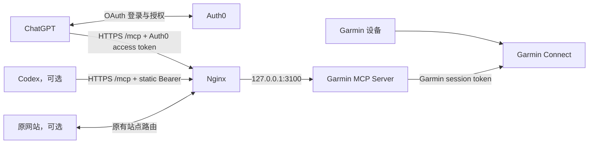

# 从一台 VPS 和一个域名部署私人 Garmin Connect MCP

这是一份面向个人用户的完整部署教程。它只假设你已经拥有一台可通过 SSH 管理的 VPS 和一个可以修改 DNS 的域名；从域名解析、Nginx/HTTPS、Node.js、Garmin 登录、Auth0 OAuth，一直到 ChatGPT 和 Codex 连接都会覆盖。

本文来自一套实际完成并验证的部署：Ubuntu 24.04、1 核 CPU、约 2 GB 内存、同机已有 Nginx/Hexo、Garmin 中国区账号、Auth0 OAuth，以及可选的 Codex 静态 Bearer 访问。没有网站的空白 VPS 也可以照做；已有博客只是本教程特别处理的一种兼容场景。文中的域名、账号、用户 ID 和令牌均为占位符。

> 适用范围：一个 Garmin 账号、一个所有者、只读查询。它不是面向公众注册的多租户 SaaS。Garmin 使用的是非官方 Web API，未来可能因 Garmin 接口变更而需要更新项目。

## 最终效果

完成后：

- VPS 通过自己的域名和 HTTPS 对外提供 MCP；
- 如果同机已有 Hexo 或其他网站，原站点继续正常使用 80/443；
- Garmin MCP 仅监听 VPS 本机的 `127.0.0.1:3100`；
- Nginx 使用独立子域名或现有 HTTPS 站点转发 `/mcp` 和 OAuth 发现路径；
- ChatGPT 通过 Auth0 登录，只获得 `garmin:read` 权限；
- Codex 可以继续使用独立的静态 Bearer 令牌；
- 你的电脑关机后，VPS 上的服务仍可使用；
- 在任何新对话中重新选择 Garmin Connect 即可，不必永远留在同一个对话。

项目提供十二个只读工具：

| 工具 | 用途 |
|---|---|
| `garmin_activities` | 最近活动和活动指标 |
| `garmin_sleep` | 睡眠时长、评分和阶段 |
| `garmin_steps` | 每日步数 |
| `garmin_heart_rate` | 静息、最低和最高心率 |
| `garmin_weight` | 体重和身体成分 |
| `garmin_workouts` | Garmin Connect 中保存的训练计划 |
| `garmin_profile` | 精简的个人资料摘要 |
| `garmin_hrv` | 昨夜 HRV、7 日均值、个人基线和状态 |
| `garmin_body_battery` | Body Battery 当前值、充入/消耗和可选日内曲线 |
| `garmin_training_readiness` | 训练准备度、恢复时间及各影响因素 |
| `garmin_training_status` | 训练状态、急性/慢性负荷、负荷比和负荷平衡 |
| `garmin_vo2max` | 跑步/骑行 VO₂max 当前值及历史趋势 |

日期范围最多为 31 天。

后五项指标需要兼容的 Garmin 设备和足够的已同步历史。Garmin Connect 尚未计算某项指标时，工具会返回 `hasData: false` 或空字段，而不是把缺失值当成 0。`garmin_body_battery` 默认只返回每日摘要；只有查询单日时才可通过 `include_samples=true` 获取日内曲线。

## 架构和三种凭据



部署中会遇到三种不同的凭据，绝对不要混用：

| 凭据 | 存放位置 | 用途 |
|---|---|---|
| Garmin session token | VPS 的受限环境文件 | MCP 代表你读取 Garmin 数据 |
| MCP static Bearer | VPS 和 Codex 所在电脑 | 可选的 Codex 客户端认证 |
| Auth0 用户和 access token | Auth0/ChatGPT OAuth 流程 | 确认是哪位用户正在访问 MCP |

不要把 Garmin session token 当成 MCP Bearer，也不要把 Garmin 密码输入 Auth0 登录页。任何一种令牌都不要提交到 Git、粘贴进聊天或写进 Nginx 配置。

## 1. 准备 VPS、域名和 HTTPS

开始前只需要准备：

- 一台 Ubuntu 22.04 或 24.04 VPS；
- 1 核 CPU、2 GB 内存和约 1 GB 可用磁盘空间；
- 一个可以添加 DNS 记录的域名；
- 一个 Garmin Connect 账号；
- 一个 Auth0 账号（第 4 节会创建或配置 tenant）；
- 可以启用开发者模式和个人 MCP 连接的 ChatGPT 账号或工作区；
- 一台可信的本地电脑，用来完成 Garmin 密码和 MFA 登录。

单用户场景的日常资源占用很低。1 GB VPS 也可能运行，但安装依赖和 TypeScript 构建时余量较小，建议准备 swap；已有约 2 GB 内存的轻量博客 VPS 通常足够。

### 1.1 决定公网地址

推荐为 MCP 使用独立子域名，例如：

```text
https://garmin.example.com/mcp
```

在域名服务商处创建 `garmin` 的 A 记录，指向 VPS 公网 IPv4。只有当 VPS 的 IPv6 已正确配置时才添加 AAAA 记录。等待解析后检查：

```bash
getent ahosts garmin.example.com
```

如果 VPS 上已经有博客，也可以直接复用现有域名，例如 `https://www.example.com/mcp`，这种情况不需要新增 DNS 或证书。专用子域名的隔离更清楚；复用现有域名则最接近本文的实际部署。后文统一用 `https://your-domain.example/mcp` 表示你最终选择的完整地址。

建议现在记下四个值，后续始终复制，不要手敲：

| 名称 | 示例 |
|---|---|
| MCP 主机名 | `garmin.example.com` |
| MCP 完整 URL | `https://garmin.example.com/mcp` |
| Auth0 tenant domain | `your-tenant.us.auth0.com` |
| Auth0 用户 ID | `auth0|xxxxxxxx` |

使用 Cloudflare 时，初次申请证书可以先设为 **DNS only**，部署成功后再决定是否开启代理。

### 1.2 检查和安装基础软件

先登录 VPS 检查环境：

```bash
cat /etc/os-release
nproc
free -h
df -h /
sudo ss -lntp
```

如果还没有 Git、Nginx 或 snapd：

```bash
sudo apt update
sudo apt install -y git nginx snapd
sudo systemctl enable --now nginx
```

再检查：

```bash
git --version
node -v
npm -v
sudo nginx -t
sudo systemctl status nginx --no-pager
command -v node
```

项目最低要求 Node.js 20。生产环境建议安装 [Node.js 官方下载页](https://nodejs.org/en/download/)列出的当前 LTS，并采用能够让 systemd 访问的系统级安装方式。如果 `node -v` 不存在、低于 20，或已经停止安全维护，请先升级。记下 `command -v node` 的结果；若不是 `/usr/bin/node`，第 6 节需要相应修改 systemd 的 `ExecStart`。

应确认：

- Node.js 为 `v20` 或更新版本；
- Nginx 配置测试成功；
- 80/443 仍由 Nginx 使用；
- 计划使用的 3100 端口没有被其他进程占用。

如果系统提示大量安全更新或需要重启，先做 VPS 快照，在维护窗口更新并重启，然后确认 SSH 和已有网站恢复正常，再继续部署。云防火墙或 UFW 至少应允许你的 SSH 端口以及 TCP 80/443，不需要开放 3100。

### 1.3 为新子域名启用 HTTPS

如果复用一个已经有可信证书的 HTTPS 域名，跳过本节。

使用新子域名时，先创建一个最小 HTTP 站点：

```bash
sudoedit /etc/nginx/sites-available/garmin-mcp
```

写入：

```nginx
server {
    listen 80;
    listen [::]:80;
    server_name garmin.example.com;

    location / {
        return 404;
    }
}
```

启用并测试：

```bash
sudo ln -s /etc/nginx/sites-available/garmin-mcp /etc/nginx/sites-enabled/garmin-mcp
sudo nginx -t
sudo systemctl reload nginx
```

然后按 [Certbot 官方 Nginx 指南](https://certbot.eff.org/instructions?ws=nginx&os=snap)安装证书。Ubuntu 常用命令如下；如果 `certbot` 已经存在，不要重复创建链接：

```bash
sudo snap install --classic certbot
sudo ln -s /snap/bin/certbot /usr/local/bin/certbot
sudo certbot --nginx -d garmin.example.com
sudo certbot renew --dry-run
```

浏览器访问 `https://garmin.example.com/`，看到可信证书即可；此时返回 404 没有关系，因为 MCP 路由还没有加入。

## 2. 在 VPS 上安装和构建项目

建议为 MCP 创建一个不能登录系统的独立用户。以下命令只需执行一次；如果 `id garmin-mcp` 已经能找到用户，就跳过 `useradd`。

```bash
id garmin-mcp
sudo useradd --system --home-dir /opt/garmin-connect-mcp --shell /usr/sbin/nologin garmin-mcp
```

克隆项目并构建：

```bash
cd /opt
sudo git clone https://github.com/getsomecat/garmin-connect-mcp.git
sudo chown -R garmin-mcp:garmin-mcp /opt/garmin-connect-mcp
cd /opt/garmin-connect-mcp
sudo -u garmin-mcp npm ci
sudo -u garmin-mcp npm run build
sudo -u garmin-mcp npm run smoke:metrics
sudo -u garmin-mcp npm run smoke:http
sudo -u garmin-mcp npm run smoke:auth0
```

五个命令都成功后再配置真实凭据。`npm run smoke:metrics` 使用合成健康数据，`npm run smoke:auth0` 使用测试配置；两者都不会登录你的 Garmin 或 Auth0 账号。

## 3. 在本地电脑导出 Garmin session

不要在 VPS 或聊天窗口里反复输入 Garmin 密码。推荐在自己的可信电脑上完成一次登录，再只把导出的 session 传到 VPS。

在本地电脑执行：

```bash
git clone https://github.com/getsomecat/garmin-connect-mcp.git
cd garmin-connect-mcp
npm ci
cp .env.example .env
```

编辑 `.env`，临时填写：

```dotenv
GARMIN_USERNAME=your-garmin-email@example.com
GARMIN_PASSWORD=your-garmin-password
GARMIN_REGION=cn
```

国际区账号把 `cn` 改为 `global`。然后运行：

```bash
umask 077
npm run --silent export-session > garmin-session.json
```

如果 Garmin 要求 MFA，脚本会提示输入一次性验证码。

- 验证码输错：按 `Ctrl+C` 结束，再重新运行导出命令，使用最新验证码；
- 网页能登录但脚本失败：先检查中国区账号是否设置了 `GARMIN_REGION=cn`；
- 连续失败多次：停止尝试一段时间，避免触发 Garmin 风控或限流；
- 成功后，删除 `.env` 中的 `GARMIN_PASSWORD`。

为避免 JSON 中的引号或换行影响 systemd 环境文件，把 session 转为单行 Base64：

```bash
base64 < garmin-session.json | tr -d '\r\n' > garmin-session.b64
```

通过 SFTP、`scp` 或你信任的密码管理器把 `garmin-session.b64` 传到 VPS。传输完成并写入服务配置后，删除本地和 VPS 上的临时文件。session 和密码都不要发给模型。

## 4. 配置 Auth0

Auth0 在这里是授权服务器。ChatGPT 先在 Auth0 登录并取得有限权限的 access token，MCP 再验证这个 token 的签名、签发方、资源、有效期、scope 和用户 ID。

### 4.1 启用 tenant 设置

打开 Auth0 Dashboard 的 **Settings → Advanced → Settings**，启用：

- **Resource Parameter Compatibility Profile**；
- **Include Issuer in Authorization Responses**；
- **Client ID Metadata Document Registration**。

其中前两项是 Auth0 官方 MCP 指南要求的发现与资源绑定设置，第三项用于导入 ChatGPT 发布的 CIMD 客户端元数据。控制台文案可能随版本稍有变化。

### 4.2 创建 API

进入 **Applications → APIs → Create API**，填写：

- Name：`Garmin Connect MCP`；
- Identifier：`https://your-domain.example/mcp`；
- Signing algorithm：`RS256`。

创建后打开该 API 的 **Permissions/Scopes** 页面，添加：

```text
garmin:read
```

Identifier 必须与后面的 `MCP_PUBLIC_URL` 和 `MCP_AUTH0_AUDIENCE` 逐字符一致。末尾多一个 `/` 也会被 Auth0 视为不同的 audience。

### 4.3 创建唯一允许的 Auth0 用户

对于私人单用户部署，建议：

1. 使用一个 Database Connection；
2. 创建一个仅供自己使用的 Auth0 用户；
3. 禁止该 Connection 的公开注册；
4. 将这个 Connection 提升为 **Domain-Level Connection**，因为 CIMD 属于第三方客户端；
5. 在用户详情页复制 **User ID**，它通常类似 `auth0|xxxxxxxx`。

稍后把这个 User ID 放入 `MCP_AUTH0_ALLOWED_SUBJECTS`。如果不设置用户白名单，tenant 中其他能登录的用户也可能访问同一个 Garmin 账号的数据。

### 4.4 导入 ChatGPT 的 CIMD

进入 **Applications → Applications → Create Application → Import from URL**，输入：

```text
https://chatgpt.com/oauth/client.json
```

先 Preview，确认名称为 ChatGPT、回调地址为：

```text
https://chatgpt.com/connector_platform_oauth_redirect
```

再创建应用。ChatGPT 的 CIMD 使用非共享密钥的客户端认证，因此不需要、也不应把 Auth0 client secret 放到 VPS。

> Auth0 官方文档说明，机密 CIMD 客户端使用 `private_key_jwt`，其可用性可能受 Auth0 套餐限制。如果导入时明确提示套餐不支持，这不是本机代理或 Garmin 代码造成的；请选择支持该能力的 Auth0 套餐，或使用项目保留的内置单用户 OAuth 回退方案。

### 4.5 只授予用户委托权限

回到刚创建的 Garmin API：

1. 在 **Settings → Application Access Policy** 中，把 User-Delegated Access 设置为 **Per-app authorization**；
2. Client Access 保持禁止或不授权；
3. 在 **Application Access** 中找到刚导入的 ChatGPT CIMD；
4. 仅对 **User-Delegated Access** 授予 `garmin:read`；
5. 不要授予 Client Credentials/Machine-to-Machine 权限。

这保证 ChatGPT 只能在你登录并授权后，以你的身份申请 `garmin:read`。

## 5. 创建 VPS 服务环境文件

先在本地或密码管理器中生成一个与 Garmin session 完全无关的静态 Bearer，供 Codex 可选使用：

```bash
openssl rand -hex 32
```

在 VPS 上创建受限文件：

```bash
sudo touch /etc/garmin-connect-mcp.env
sudo chown root:garmin-mcp /etc/garmin-connect-mcp.env
sudo chmod 0640 /etc/garmin-connect-mcp.env
sudoedit /etc/garmin-connect-mcp.env
```

写入以下内容，并替换所有占位符：

```dotenv
GARMIN_SESSION_TOKEN_B64=PASTE_THE_SINGLE_LINE_BASE64_SESSION_HERE
GARMIN_REGION=cn

GARMIN_CACHE_TTL=300
GARMIN_CACHE_MAX_ENTRIES=100
GARMIN_RETRY_ATTEMPTS=3
GARMIN_RETRY_BASE_DELAY_MS=1000
GARMIN_RETRY_MAX_DELAY_MS=30000
GARMIN_ACTIVITY_DETAIL=compact
GARMIN_LOG_LEVEL=info

MCP_TRANSPORT=http
MCP_HTTP_HOST=127.0.0.1
MCP_HTTP_PORT=3100
MCP_HTTP_PATH=/mcp

# 可选：给 Codex 使用，至少 32 字节，不是 Garmin session。
MCP_BEARER_TOKEN=PASTE_THE_INDEPENDENT_STATIC_BEARER_HERE

MCP_PUBLIC_URL=https://your-domain.example/mcp
MCP_AUTH0_DOMAIN=your-tenant.us.auth0.com
MCP_AUTH0_AUDIENCE=https://your-domain.example/mcp
MCP_AUTH0_ALLOWED_SUBJECTS=auth0|your-user-id
```

注意：

- `MCP_AUTH0_DOMAIN` 不包含 `https://` 和路径；
- `MCP_PUBLIC_URL`、Auth0 API Identifier、`MCP_AUTH0_AUDIENCE` 必须完全相同；
- Auth0 模式下不要设置任何 `MCP_OAUTH_*` 变量；
- 如果不使用 Codex，可以省略 `MCP_BEARER_TOKEN`；
- 不要在这里保留 `GARMIN_USERNAME` 和 `GARMIN_PASSWORD`。

## 6. 安装 systemd 服务

先再次检查 Node 的绝对路径：

```bash
command -v node
```

```bash
cd /opt/garmin-connect-mcp
sudo cp deploy/systemd/garmin-connect-mcp.service.example /etc/systemd/system/garmin-connect-mcp.service
```

项目模板的 `ExecStart` 使用 `/usr/bin/node`。如果 `command -v node` 的结果不同，现在运行 `sudoedit /etc/systemd/system/garmin-connect-mcp.service`，把 `ExecStart` 改为实际绝对路径。

启动服务：

```bash
sudo systemctl daemon-reload
sudo systemctl enable --now garmin-connect-mcp
sudo systemctl status garmin-connect-mcp --no-pager
sudo journalctl -u garmin-connect-mcp -n 100 --no-pager
curl -fsS http://127.0.0.1:3100/healthz
```

最后一个命令应返回健康状态。再确认 3100 只监听回环地址：

```bash
sudo ss -lntp | grep ':3100'
```

预期是 `127.0.0.1:3100`，而不是 `0.0.0.0:3100`。防火墙不需要开放 3100。

## 7. 在 Nginx 中增加 MCP 路由

把项目提供的 location 片段复制为 Nginx snippet：

```bash
sudo cp /opt/garmin-connect-mcp/deploy/nginx/garmin-connect-mcp.conf.example /etc/nginx/snippets/garmin-connect-mcp.conf
```

然后在第 1 节创建的子域名，或已有网站域名的 HTTPS `server { ... }` 块内部加入：

```nginx
include /etc/nginx/snippets/garmin-connect-mcp.conf;
```

该 snippet 的核心内容是：

```nginx
location ~ ^/(mcp|authorize|token|register|revoke|oauth/approve|\.well-known/oauth-(protected-resource(/mcp)?|authorization-server))$ {
    proxy_pass http://127.0.0.1:3100;
    proxy_http_version 1.1;
    proxy_set_header Host $host;
    proxy_set_header Authorization $http_authorization;
    proxy_set_header X-Forwarded-For $proxy_add_x_forwarded_for;
    proxy_set_header X-Forwarded-Host $host;
    proxy_set_header X-Forwarded-Proto $scheme;
    proxy_buffering off;
    proxy_read_timeout 130s;
    proxy_send_timeout 130s;
    client_max_body_size 1m;
}
```

测试并平滑重载：

```bash
sudo nginx -t
sudo systemctl reload nginx
```

平滑重载不会停止已有网站。如果同机有 Hexo 或其他站点，立即检查首页和静态资源仍然正常，然后测试：

```bash
curl -fsS https://your-domain.example/.well-known/oauth-protected-resource/mcp
curl -i https://your-domain.example/mcp
```

第一条应返回 JSON，里面的 `resource` 是 `https://your-domain.example/mcp`，`authorization_servers` 指向 Auth0 tenant。第二条在没有凭据时返回 `401 Unauthorized` 是正常的安全行为。

如果原站点存在 `location ^~ /`，它可能阻止正则 location 生效；应为 MCP 路径添加更明确的 location，或去掉会吞掉所有子路径的 `^~`，然后再次执行 `nginx -t`。

### 可选：Cloudflare

如果域名经过 Cloudflare：

- SSL/TLS 建议使用 **Full (strict)**；
- 不要缓存 `/mcp` 和 `/.well-known/oauth-*`；
- 不要对这些路径启用会返回 HTML 的浏览器质询、验证码或页面改写；
- 仍只让源站公开 80/443，不开放 3100。

## 8. 在 ChatGPT 中连接

OpenAI 官方流程要求先有公网 HTTPS Streamable HTTP MCP endpoint，再在 ChatGPT 开启开发者模式并创建连接：

1. 打开 **Settings → Security and login**，启用 **Developer mode**；
2. 打开 **Plugins**（某些界面称 Apps/Connectors），点击添加；
3. 名称填写 `Garmin Connect`；
4. MCP URL 填写 `https://your-domain.example/mcp`；
5. 选择 OAuth，并检查发现结果；
6. 确认授权服务器是 `https://your-tenant.us.auth0.com/`；
7. 确认 scope 包含且只需要 `garmin:read`；
8. 创建连接，使用刚创建的 Auth0 用户登录并授权；
9. 刷新工具列表，确认出现十二个 Garmin 工具。

第一次测试建议使用不展示个人资料内容的请求：

```text
调用 garmin_profile，只告诉我调用是否成功以及返回结构是否正常，不要显示姓名、邮箱或其他个人字段。
```

成功后再尝试：

- “分析我最近 14 天的跑步训练量和恢复状态。”
- “比较最近 7 天和之前 7 天的睡眠、静息心率和步数。”
- “比较最近 7 天的 HRV、Body Battery、训练准备度和恢复时间。”
- “读取急性/慢性训练负荷、负荷比、训练状态和最近 30 天 VO₂max 趋势。”
- “列出本周训练，但不要输出个人资料字段。”

在新对话中，需要从工具菜单重新选择 Garmin Connect；无需重新部署。手机端登录同一 ChatGPT 账号后，如果该客户端显示这个开发者连接，也可以选择使用；如果移动端暂时不显示，请用 ChatGPT 网页版或桌面版。是否展示个人开发者连接可能受客户端版本和工作区策略影响。

### 避免旧 OAuth 配置缓存

如果同一个 URL 以前连接过项目内置 OAuth，ChatGPT 可能继续打开：

```text
https://your-domain.example/authorize
```

在 Auth0 模式下，本机 `/authorize` 返回 404 是预期行为；正确的授权页应在 Auth0 tenant 域名。稳妥处理方法是：

1. 暂时保留旧连接；
2. 用一个新名称创建全新的个人连接；
3. 确认新连接发现 Auth0 并成功调用工具；
4. 再删除旧连接，把新连接改成原来的名称。

修改认证或工具元数据后，先在连接设置中执行 **Refresh**，再开启一个新对话测试。反复在旧连接上重试通常不会清除已缓存的 OAuth 元数据。

## 9. 可选：让 Codex 远程使用同一 VPS

Codex 可以使用独立静态 Bearer，不必参与 ChatGPT/Auth0 登录。把以下配置加入可信项目的 `.codex/config.toml`，或个人的 `~/.codex/config.toml`：

```toml
[mcp_servers.garmin_connect]
url = "https://your-domain.example/mcp"
bearer_token_env_var = "GARMIN_MCP_BEARER_TOKEN"
startup_timeout_sec = 20
tool_timeout_sec = 120
```

环境变量的内容必须与 VPS 上的 `MCP_BEARER_TOKEN` 相同。macOS 桌面应用可以把令牌保存到权限为 `0600` 的本地文件，再加载到图形会话环境。以下命令在 macOS 默认 zsh 中不会把输入回显到屏幕：

```zsh
mkdir -p ~/.codex/secrets
chmod 700 ~/.codex/secrets
umask 077
read -s "GARMIN_TOKEN?MCP Bearer token: "
print -r -- "$GARMIN_TOKEN" > ~/.codex/secrets/garmin-mcp-bearer-token
unset GARMIN_TOKEN
launchctl setenv GARMIN_MCP_BEARER_TOKEN "$(tr -d '\r\n' < ~/.codex/secrets/garmin-mcp-bearer-token)"
```

完全退出并重新打开 Codex，然后执行 `/mcp` 或打开 MCP 设置确认连接。这个本地文件也不要加入任何 Git 仓库。

## 10. 验收清单

逐项确认：

- [ ] 域名的 HTTPS 证书可信；
- [ ] 如果同机有原网站，其首页和静态资源正常；
- [ ] `nginx -t` 成功；
- [ ] systemd 服务为 `active (running)`；
- [ ] 3100 只监听 `127.0.0.1`；
- [ ] `/healthz` 在 VPS 本机返回成功；
- [ ] OAuth protected-resource metadata 的 resource 和 issuer 正确；
- [ ] 未登录访问 `/mcp` 返回 401；
- [ ] Auth0 只创建了 `garmin:read` 用户委托授权；
- [ ] `MCP_AUTH0_ALLOWED_SUBJECTS` 是自己的准确 User ID；
- [ ] ChatGPT 看到十二个工具；
- [ ] `garmin_profile` 端到端调用成功；
- [ ] Git 历史、日志和聊天里没有任何 session、密码或 Bearer。

## 11. 常见问题

| 现象 | 最可能原因 | 处理方法 |
|---|---|---|
| Garmin 网页能登录，导出脚本却报密码错误 | 中国区/国际区不一致，或连续尝试触发风控 | 中国区设 `GARMIN_REGION=cn`；停止频繁重试后重新导出 session |
| MFA 验证码输错 | 验证码已失效或只能使用一次 | `Ctrl+C` 后重新运行导出脚本，输入最新验证码 |
| Garmin 返回 429 | 查询过于频繁 | 项目会指数退避；避免连续重复大范围查询，单次日期范围不超过 31 天 |
| `502 Bad Gateway` | Node 服务未运行或 Nginx 端口不一致 | 查 `systemctl status`、`journalctl` 和 `127.0.0.1:3100/healthz` |
| 未登录访问 `/mcp` 返回 401 | 正常的认证挑战 | 继续检查 `WWW-Authenticate` 和 protected-resource metadata |
| Auth0 登录成功但 MCP 仍返回 401 | audience、scope 或用户 `sub` 不匹配 | 对照三个完全相同的 MCP URL，确认 `garmin:read` 和 allowlist User ID |
| ChatGPT 打开本机 `/authorize` 并得到 404 | 旧连接缓存了内置 OAuth 元数据 | 新建一个全新的连接完成 Auth0 发现，验证后再删除旧连接 |
| ChatGPT 一直转圈，Auth0 日志没有请求 | 客户端缓存、弹窗/代理/浏览器扩展拦截 | 先检查授权 URL 是否为 Auth0；用新连接测试，并在同一浏览器中临时排除拦截 |
| ChatGPT 显示的工具不是十二个 | 连接尚未刷新 | 在插件设置执行 Refresh，并在新对话中重新添加工具 |
| HRV、训练准备度或 VO₂max 返回空值 | 设备不支持、历史不足或数据尚未同步 | 先确认 Garmin Connect App 中能看到该指标，再缩小到最近有记录的日期重试 |
| Mac ChatGPT 应用意外退出 | 客户端问题，不足以证明服务端 OAuth 失败 | 用网页版完成配置；更新/重开客户端，并以 VPS/Auth0 日志判断请求是否到达 |
| Garmin session 过期 | Garmin 撤销或失效了长期 session | 在可信电脑重新运行 `export-session`，更新 Base64 后重启服务 |
| 加入 MCP 后博客路由异常 | snippet 放错 server 块，或现有 `^~ /` 抢占路径 | 恢复备份、运行 `nginx -t`，只在正确 HTTPS server 中加入 MCP location |
| 手机端看不到连接 | 客户端版本或工作区策略暂未开放个人开发者连接 | 使用同一账号的网页或桌面端；服务本身仍在 VPS 上运行 |

本地代理确实可能影响浏览器跳转、Cookie 或 Auth0 页面加载，但它不会把 MCP 的 Auth0 配置自动改成本机 `/authorize`。判断时以三类证据为准：浏览器地址栏、Auth0 tenant 日志、VPS Nginx/systemd 日志。若 Auth0 完全没有收到请求且地址栏指向自己的域名，优先排查旧连接缓存。

## 12. 更新项目

更新前先确认 Git 工作区没有手工改动：

```bash
cd /opt/garmin-connect-mcp
sudo -u garmin-mcp git status --short
sudo -u garmin-mcp git pull --ff-only origin main
sudo -u garmin-mcp npm ci
sudo -u garmin-mcp npm run build
sudo -u garmin-mcp npm run smoke:http
sudo -u garmin-mcp npm run smoke:auth0
sudo systemctl restart garmin-connect-mcp
sudo systemctl status garmin-connect-mcp --no-pager
curl -fsS http://127.0.0.1:3100/healthz
```

如果工具或认证元数据有变化，再到 ChatGPT 连接设置中执行 Refresh，并使用新对话验证。

## 13. 回退和备份

修改前备份：

- `/etc/garmin-connect-mcp.env`；
- 现有 Nginx HTTPS 站点配置；
- 当前可工作的项目 commit ID；
- Auth0 API、CIMD 应用和用户授权设置的截图或导出。

如果 MCP 部署失败但博客必须立即恢复：

1. 从 HTTPS server 块移除 MCP snippet 的 `include`；
2. 运行 `sudo nginx -t`；
3. 运行 `sudo systemctl reload nginx`；
4. 停止 MCP 服务；
5. 验证博客首页。

项目还保留了内置单用户 OAuth 作为回退，但它不能与 Auth0 同时启用。具体变量和安全限制见根目录 [README](../README.md#built-in-single-user-fallback)。

## 14. 安全和隐私检查

- 只读不等于不敏感：睡眠、体重、心率和活动仍是健康隐私数据；
- 禁止 Auth0 Database Connection 的公开注册；
- 始终设置 `MCP_AUTH0_ALLOWED_SUBJECTS`；
- 只授予 `garmin:read` 用户委托权限；
- 不公开 3100，不把 Node 服务绑定到 `0.0.0.0`；
- 所有公网访问必须经过可信 HTTPS；
- 环境文件为 `0640`，本地 secret 文件为 `0600`；
- 不在 Nginx、Git、聊天、截图或日志中出现凭据；
- 怀疑泄露时，立即轮换 MCP Bearer、重新导出 Garmin session，并在 Auth0 撤销会话或授权；
- 不要把单用户实例开放给其他人，因为所有通过验证的调用最终读取的是同一个 Garmin 账号。

## 官方参考

- [OpenAI：将远程 MCP 连接到 ChatGPT](https://developers.openai.com/plugins/deploy/connect-chatgpt)
- [OpenAI：MCP/OAuth 认证要求](https://developers.openai.com/plugins/build/auth)
- [OpenAI：Codex MCP 配置](https://developers.openai.com/codex/mcp/)
- [Auth0：为 MCP Server 配置授权](https://auth0.com/ai/docs/mcp/get-started/authorization-for-your-mcp-server)
- [Auth0：Manual CIMD Registration](https://auth0.com/ai/docs/mcp/guides/registering-your-mcp-client-application/manual-cimd-registration)
- [Auth0：第三方应用和 API client grants](https://auth0.com/docs/get-started/applications/third-party-applications/configure-third-party-applications)
